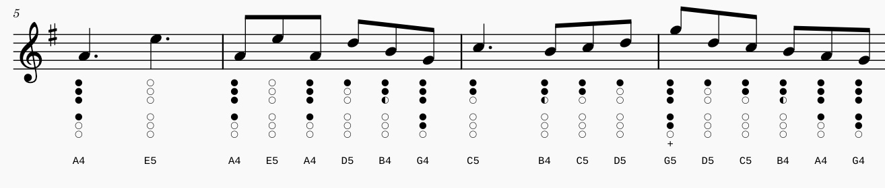
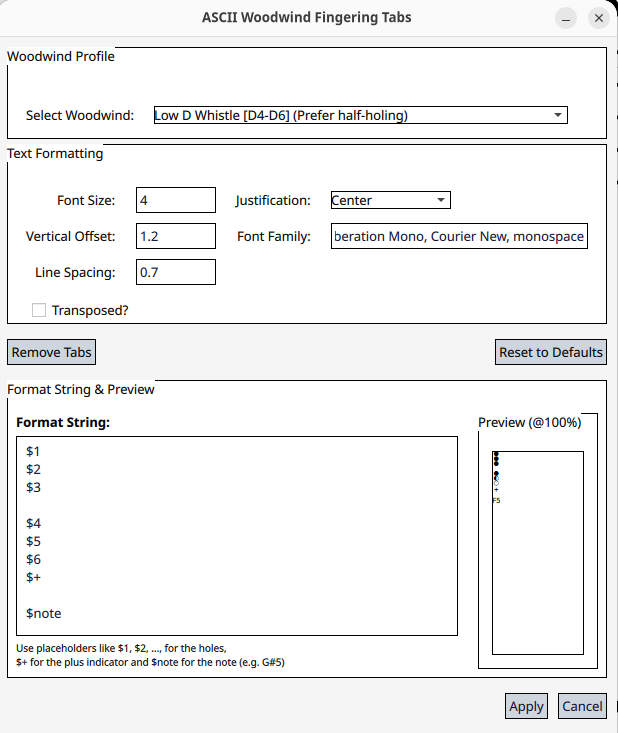
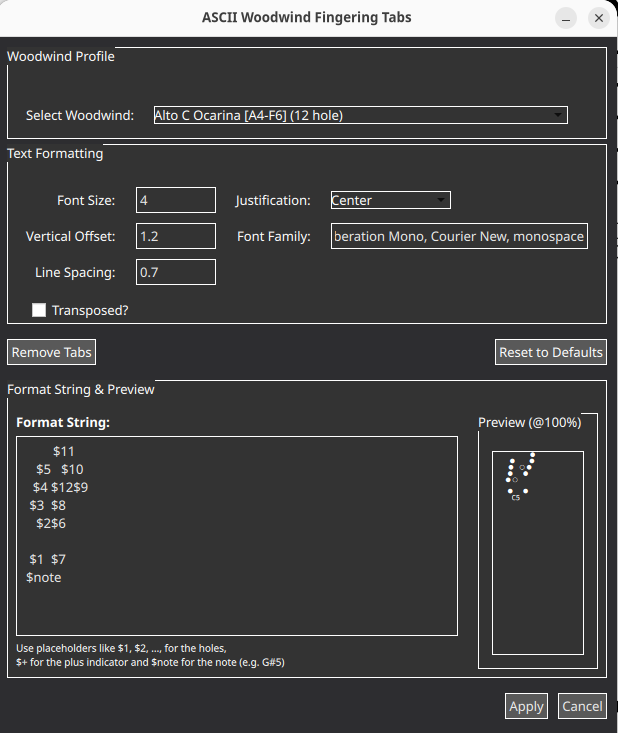
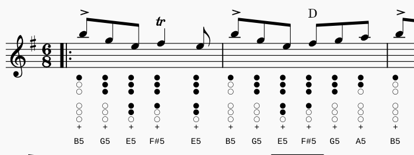
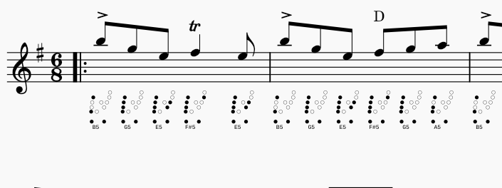

# Woodwind Tab Generator for MuseScore 4

A MuseScore Studio V4.X plugin for highly flexible fingering tab creation for woodwinds, using the familiar tin whistle tab style.

## Contents

- [Overview](#overview)
- [Installation](#installation)
- [Usage](#usage)
- [Adding Your Own Woodwinds](#adding-your-own-woodwinds)
- [Troubleshooting](#troubleshooting)

---

## Overview

This plugin offers several predefined whistles as well as custom alternative woodwinds (e.g. Ocarina). The following are fully user-customizable:

- Font size, family, and justification
- Spacing and vertical offset from the staff
- Layout of the finger holes

The plugin also remembers settings, responds to dark and light mode themes, supports undo and redo, and provides a live preview of note fingering with the selected settings.

---
<p align="center">
  
</p>

This plugin was inspired by the [tin-whistle-tablature project](https://github.com/jgadsden/tin-whistle-tablature/tree/main), which has the notable advantage of reducing diagram size for short notes. This project also offers several additional advantages:

- **Completely customizable fingering diagrams** with support for an unlimited number of holes — especially useful for makers of unique designs such as the [Chromophone](https://www.natco.co/khromophone/specs.php), or uncommon whistles and woodwinds.
- **Font installation is optional** — required custom font glyphs are sideloaded automatically when the extension loads.
- **Diagrams are constructed one hole at a time** — the inserted diagram is plain text and can be edited as such.
- **Customizable look with intelligent overwriting** — font, size, justification, offset, line spacing, and transposition are all supported. Modifying tabs cleanly replaces existing ones if present.
- **Add your own whistles!** Strange cross-fingerings? Custom preferences? A 9-hole G whistle? No problem.

---

## Installation

> **Note:** This plugin was tested on MuseScore 4. API compatibility with other versions has not been evaluated.

1. Download `Woodwind_Tab_Generator.zip` from the releases page.
2. Extract the zip file to a folder.
3. Follow the [MuseScore plugin installation instructions](https://musescore.org/en/handbook/4/plugins#installation), starting from step 5 — drop the `Woodwind_Tab_Generator` folder (containing the `.qml` file, icon, and font) into the MuseScore plugin directory.
4. Run the plugin from the plugin menu to open the configuration window.

---

## Usage

Opening the plugin presents the configuration window:

<div style="display: flex; gap: 16px;">
  <figure>
    
    <figcaption><em>Light mode</em></figcaption>
  </figure>
  <figure>
    
    <figcaption><em>Dark mode</em></figcaption>
  </figure>
</div>

From here you can select a woodwind definition, customize settings or the format string, and apply to generate the tab.

**Examples:**

>
*Low D Whistle*

>
*Alto C Ocarina*
---

## Adding Your Own Woodwinds

1. Open `woodwind_tab_generator.qml` and navigate to the section:
```text
//---------------------------------------------------------
// FINGERING DICTIONARY
// Last bit = plus sign indicator
//---------------------------------------------------------
```

2. Add your own fingering definition in the same format as the existing examples, using the following fields:

> **Note:** Notes are currently defined by their sounding pitch, not their written notation (relevant for transposing instruments).

| Field | Description |
|---|---|
| `name` | The name of the woodwind as shown in the GUI. |
| `fingeringDict` | A dictionary of notes and fingering patterns. Uses note names (sharps required) and numerical fingering representations. Left→right, starting from hole one (represented as `$1..`), with the last digit indicating the number of times to overblow (accessed with the `$+` variable). |
| `formatString` | The string used to lay out the holes on the tab. Use `\n` for a new line. |

**Tip for complex layouts (e.g. Ocarina):** Use a temporary template in the format string field, open the plugin, and adjust the layout using the preview as a guide. Then copy the format string (including whitespace) into a text editor and replace literal newlines (`\n`) with `\\n` — you may need to enable regex replace in your editor. See the Ocarina definition for an example of a more complex layout.


*Example instrument entry*

If you'd prefer, you can also open an issue with a clear description of your instrument and fingering patterns and I can add it for you.

---

## Troubleshooting

>#### My tab symbols are smaller after saving and reloading the project
This plugin loads its own font to ensure that all three symbols render at a constant size. However, since the font isn't loaded until the plugin starts, MuseScore may fall back to a default font on reload.

To fix this, either:
- Re-insert the tab using the plugin, or
- Install `WhistleSymbols.ttf` (found in the `woodwind_tab_generator` plugin folder) system-wide:
  - **Windows:** Right-click → *Install for all users*
  - **Linux:** Open with your system's font manager and install

>#### I am getting ☒ symbols underneath my notes
This means the note couldn't be found in your instrument definition — i.e. it cannot be played on your instrument.

Try transposing the music. If you are using an instrument like a whistle where the notation is written an octave lower than it sounds, check the **Transposed** box in the plugin settings.


---

## Feedback

Did you find this plugin useful? Found a bug, or have a feature request? Feel free to [open an issue](../../issues) or leave a star :)
